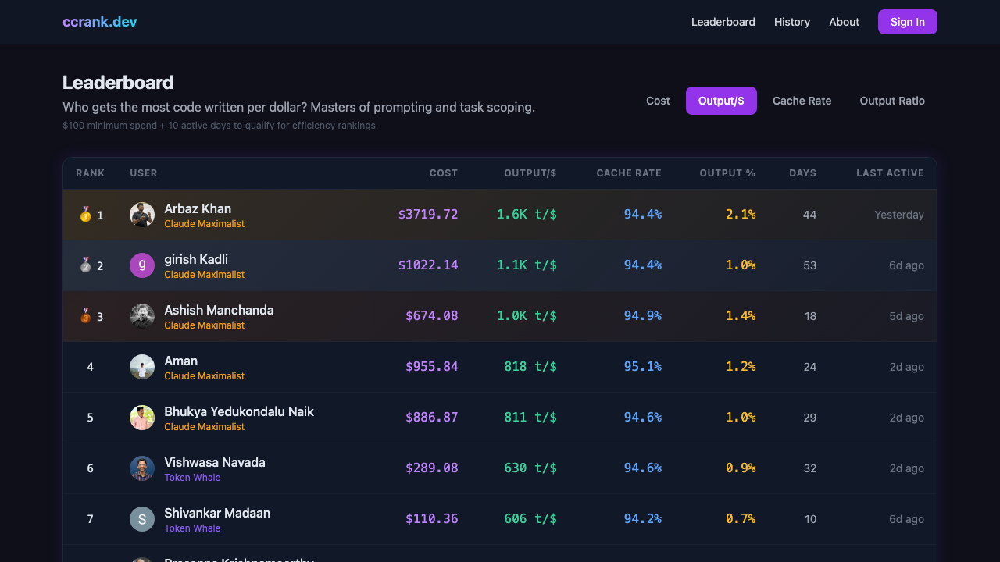

<div align="center">

# Claude Leaderboard

### Who burns the most Claude tokens on your team?

[](https://ccrank.dev)

[](https://workers.cloudflare.com)
[](https://hono.dev)
[](https://typescriptlang.org)
[](https://tailwindcss.com)
[](https://opensource.org/licenses/MIT)

**Track, compare, and compete on [Claude Code](https://claude.ai) usage across your team.**
Upload [ccusage](https://github.com/ryoppippi/ccusage) reports. See the leaderboard. Earn titles. Talk trash.

Deploy to Cloudflare Workers in under 10 minutes. Free tier. Zero cost.

<br />

<a href="https://ccrank.dev/leaderboard?sort=output_per_dollar">
  
</a>

<br />
<br />

[Live Demo](https://ccrank.dev) &nbsp;&middot;&nbsp; [Quick Start](#-quick-start) &nbsp;&middot;&nbsp; [Features](#-features) &nbsp;&middot;&nbsp; [API](#-api-routes)

</div>

---

## Origin Story

It started with a WhatsApp message:

> *"Code a Leaderboard Vivek? Let everyone submit their ccusage :)"*

The entire app was built on a phone using [Claude Code](https://claude.ai), deployed to Cloudflare Workers in minutes, and has been running at [ccrank.dev](https://ccrank.dev) ever since. No laptop required. Just vibes and Claude.

---

## Features

| | Feature | Description |
|---|---|---|
| :trophy: | **Live Leaderboard** | Ranked by total cost, tokens, days active, and last activity |
| :medal_sports: | **Gamified Titles** | Apprentice, Practitioner, Power User, Token Whale, Claude Maximalist |
| :clock3: | **Time-Travel History** | Browse daily, weekly, and monthly snapshots with date navigation |
| :computer: | **Multi-Machine Tracking** | Aggregate usage across laptops, desktops, and cloud instances |
| :frame_with_picture: | **Shareable Social Cards** | OG-image-ready SVG cards with your stats for Twitter/LinkedIn |
| :lock: | **Google OAuth** | One-click sign-in, no passwords |
| :ticket: | **Invite-Only Registration** | Each user gets 3 invite codes to share |
| :gear: | **Admin Panel** | Bulk invite generation, platform-wide stats |
| :new_moon: | **Dark Theme** | Beautiful dark UI, fully responsive on mobile |
| :moneybag: | **Zero Cost Hosting** | Runs entirely on Cloudflare Workers + D1 free tier |

---

## Quick Start

### Prerequisites

- [Node.js](https://nodejs.org) v18+
- [Cloudflare](https://cloudflare.com) account (free tier)
- [Google Cloud](https://console.cloud.google.com) project (for OAuth)

### 1. Clone and install

```bash
git clone https://github.com/makash/claude-leaderboard-using-ccusage.git
cd claude-leaderboard-using-ccusage
npm install
```

### 2. Create D1 database

```bash
npx wrangler login
npx wrangler d1 create claude-leaderboard-db
```

Copy the `database_id` into `wrangler.toml`:

```toml
[[d1_databases]]
binding = "DB"
database_name = "claude-leaderboard-db"
database_id = "YOUR_DATABASE_ID_HERE"
```

### 3. Run migrations

```bash
npm run db:migrate
npm run db:seed
```

### 4. Configure Google OAuth

1. Create an **OAuth 2.0 Client ID** at [Google Cloud Console > Credentials](https://console.cloud.google.com/apis/credentials)
2. Add redirect URI: `https://your-worker.workers.dev/auth/google/callback`
3. Update `wrangler.toml`:
   ```toml
   [vars]
   GOOGLE_CLIENT_ID = "your-client-id.apps.googleusercontent.com"
   ADMIN_EMAIL = "you@gmail.com"
   ```
4. Set secrets:
   ```bash
   npx wrangler secret put GOOGLE_CLIENT_SECRET
   npx wrangler secret put SESSION_SECRET    # use: openssl rand -hex 32
   ```

### 5. Deploy

```bash
npm run deploy
```

Share the URL. Start competing.

---

## Usage

### Generate your report

```bash
npx ccusage@latest daily --json > report.json
```

### Upload it

Sign in at your leaderboard URL, go to **Upload**, and drop in the JSON. Re-uploading is safe -- existing dates update, new dates get added.

### Git metadata (optional)

Add git activity to your profile with a local upload:

```bash
npm run git:upload -- --url https://your-worker.workers.dev --token YOUR_TOKEN
```

Or run both git + ccusage in one go:

```bash
npm run git:upload -- --url https://your-worker.workers.dev --token YOUR_TOKEN --all
```

Go CLI supports multi-repo scanning and machine names. See `docs/git-metadata.md`.

Generate your token in **Settings → Git Metadata**. Full details in `docs/git-metadata.md` (includes Go CLI downloads).

### Invite your team

Each user gets 3 invite codes. Go to **Invites** to generate and share them. Admins can bulk-generate from the admin panel.

---

## API Routes

| Method | Path | Auth | Description |
|--------|------|------|-------------|
| `GET` | `/` | Optional | Landing / dashboard |
| `GET` | `/leaderboard` | No | Public leaderboard |
| `GET` | `/history` | No | Time-travel history |
| `GET` | `/about` | No | Origin story |
| `GET` | `/card/:slug` | No | Public stats card |
| `GET` | `/card/:slug/image.svg` | No | OG image (SVG) |
| `GET` | `/settings` | Yes | Sharing settings |
| `GET` | `/upload` | Yes | Upload form |
| `GET` | `/invites` | Yes | Manage invites |
| `GET` | `/admin` | Admin | Admin panel |
| `POST` | `/api/upload` | Yes | Upload ccusage JSON |
| `POST` | `/api/settings/sharing` | Yes | Save sharing prefs |
| `GET` | `/api/leaderboard` | No | Leaderboard JSON |
| `GET` | `/api/me` | Yes | Current user + stats |
| `POST` | `/api/invites/create` | Yes | Generate invite code |
| `POST` | `/api/admin/invites` | Admin | Bulk invite codes |

---

## Project Structure

```
src/
  index.ts        Hono routes, middleware, API endpoints
  auth.ts         HMAC-SHA256 sessions + Google OAuth
  parser.ts       ccusage JSON parser (daily/weekly/session)
  html.ts         Dark-themed HTML templates (Tailwind CSS)
  utils.ts        Shared types and utilities
  card.ts         Social card SVG generation (satori)
  images.ts       Base64 screenshots for About page
migrations/
  0001_initial.sql         Database schema
  0002_seed_invites.sql    Seed invite codes
  0003_add_source.sql      Multi-machine tracking
  0004_drop_old_index.sql  Index cleanup
  0005_add_sharing.sql     Social card sharing
```

---

## Local Development

```bash
npm run db:migrate:local
npm run db:seed:local

# Create .dev.vars for local secrets
cat > .dev.vars << 'EOF'
GOOGLE_CLIENT_ID=your-client-id
GOOGLE_CLIENT_SECRET=your-client-secret
SESSION_SECRET=dev-secret-change-me
ADMIN_EMAIL=you@gmail.com
EOF

npm run dev
```

Add `http://localhost:8787/auth/google/callback` as an authorized redirect URI in Google Cloud Console.

---

## Built With

<table>
  <tr>
    <td align="center" width="140">
      <a href="https://hono.dev">
        <br />
        <b>Hono</b>
      </a><br />
      <sub>Web framework</sub>
    </td>
    <td align="center" width="140">
      <a href="https://workers.cloudflare.com">
        <br />
        <b>CF Workers</b>
      </a><br />
      <sub>Serverless compute</sub>
    </td>
    <td align="center" width="140">
      <a href="https://developers.cloudflare.com/d1/">
        <br />
        <b>D1 (SQLite)</b>
      </a><br />
      <sub>Edge database</sub>
    </td>
    <td align="center" width="140">
      <a href="https://tailwindcss.com">
        <br />
        <b>Tailwind CSS</b>
      </a><br />
      <sub>Styling via CDN</sub>
    </td>
    <td align="center" width="140">
      <a href="https://github.com/ryoppippi/ccusage">
        <br />
        <b>ccusage</b>
      </a><br />
      <sub>Usage tracking CLI</sub>
    </td>
  </tr>
</table>

---

## Contributing

Contributions are welcome! Feel free to open issues and pull requests.

1. Fork the repository
2. Create your feature branch (`git checkout -b feat/amazing-feature`)
3. Commit your changes (`git commit -m 'Add amazing feature'`)
4. Push to the branch (`git push origin feat/amazing-feature`)
5. Open a Pull Request

---

## Author

**Akash Mahajan** ([@makash](https://github.com/makash))

[](https://github.com/makash)
[](https://x.com/makash)
[](https://www.linkedin.com/in/akashm/)
[](https://www.youtube.com/@makash)

If you deploy this for your team, I would love to hear about it -- [tweet at me](https://x.com/makash)!

---

## License

MIT

---

<div align="center">
  <sub>Built with Claude Code. Deployed from a phone. Powered by <a href="https://github.com/ryoppippi/ccusage">ccusage</a> by <a href="https://github.com/ryoppippi">ryoppippi</a>.</sub>
</div>
