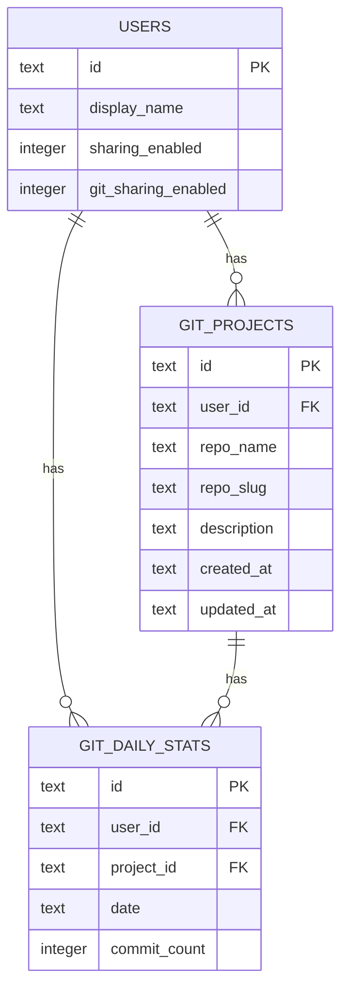

# ✨ feat: Add git metadata to profiles

## Overview
Add git-based metadata to user profiles so usage feels personal and users can see if Claude usage correlates with recent commit velocity. A local CLI/agent will collect per-project git activity and upload a 28‑day daily time series plus a project summary. The profile will show aggregate metrics and a drill‑down project list on the same page, with a separate visibility toggle for git data.

## Problem Statement / Motivation
Today profiles show Claude usage only. Teams care about whether that usage changes shipping velocity and which projects are benefiting. Adding git metadata provides a user‑owned, opt‑in signal to make the leaderboard more meaningful without exposing raw git history.

## Proposed Solution
- Introduce a git metadata data model (projects + daily stats) with 28‑day retention.
- Extend profile and settings to show git metrics and let users control visibility.
- Build server endpoints for git metadata upload and retrieval.
- Create a local CLI/agent flow that extracts git data and uploads it to the user’s account.
- Add a lightweight thumbs up/down feedback widget for the new section.

## Technical Approach

### Architecture
- **Data**: new tables for git projects and daily activity (per user, per project, per day).
- **API**: new authenticated endpoint to accept git metadata uploads (similar to `/api/upload`).
- **UI**: profile page adds an aggregate section and project list with trends. Settings page adds a git‑visibility toggle.
- **CLI/Agent**: external companion (could be a small node script or separate package) to collect git stats locally and upload.

### Implementation Phases

#### Phase 1: Data Model & Storage
- Add migrations for git project metadata and daily activity tables.
- Store project summaries (name + description) and daily commit counts.
- Define retention rules (last 28 days; overwrite on upload).

#### Phase 2: API + Auth
- Create `POST /api/git/upload` for authenticated uploads.
- Add `GET /api/git/me` or embed git stats in `/api/me` for profile rendering.
- Add user setting `git_sharing_enabled` (separate from `sharing_enabled`).

#### Phase 3: Profile UI + Settings
- Update profile view to show aggregate metrics + project list on same page.
- Add daily trend lines for git activity and Claude usage (side‑by‑side, no computed correlation).
- Add git metadata visibility toggle on settings page.

#### Phase 4: CLI/Agent + Feedback
- Define CLI output schema (per project daily series + summary + repo description).
- Add thumbs up/down feedback widget in profile section to gather sentiment.

## Alternative Approaches Considered
- **Summary‑only upload**: simpler but cannot show trends or “moved the needle” narrative.
- **Project subpages**: more detail but adds navigation and complexity early on.

## Acceptance Criteria

### Functional Requirements
- [x] Authenticated users can upload git metadata for one or more projects.
- [x] Profile displays aggregate git metrics (commit velocity + streak) for last 28 days.
- [x] Profile shows per‑project drill‑down list with daily commit trend.
- [x] Git activity trend displays alongside Claude usage trend (no correlation score).
- [x] Users can toggle git metadata visibility independently of profile sharing.
- [x] Project description is auto‑derived but editable on upload.
- [x] Feedback widget captures thumbs up/down and stores result.

### Non‑Functional Requirements
- [x] Storage is bounded to last 28 days per project.
- [x] Upload endpoint validates schema and rejects malformed payloads.
- [x] Profile renders gracefully when git metadata is absent.

### Quality Gates
- [ ] New migrations applied locally and in production.
- [ ] Basic tests for upload validation and visibility gating.
- [x] Documentation updates for the CLI/agent flow.

## Success Metrics
- % of active users who upload git metadata within 2 weeks.
- % of profiles with git metadata visibility enabled.
- Feedback widget ratio (thumbs up vs thumbs down).

## Dependencies & Prerequisites
- A local CLI/agent capability (could live in this repo or a small companion repo).
- D1 migration support for new git metadata tables.

## Risk Analysis & Mitigation
- **Privacy risk**: mitigate with separate git visibility toggle and no raw history upload.
- **Data correctness**: mitigate with schema validation + clear CLI documentation.
- **Misleading interpretation**: avoid explicit correlation score; show trends side‑by‑side.

## SpecFlow Analysis (User Flows & Gaps)

### User Flow Overview
1. User runs CLI in a repo → uploads git metadata.
2. User visits profile → sees aggregate + project list (if enabled).
3. User disables git sharing → git section hidden from public viewers.
4. Viewer visits a public profile → sees git section only if enabled.

### Missing Elements & Gaps
- **Validation**: exact schema and size limits for upload payload.
- **Edits**: how users update project descriptions after upload.

### Critical Questions
- None.

## Data Model (ERD)

## Documentation Plan
- Add a short “Git metadata upload” section to `README.md`.
- Add CLI usage example in `docs/` or a new `docs/git-metadata.md`.

## AI‑Era Considerations
- Note any AI‑generated code in review notes.
- Ensure validation logic and migrations are human‑reviewed.

## References & Research

### Internal References
- `src/index.ts` (auth, routes, `/api/upload` pattern, profile + settings handling)
- `src/html.ts` (profile layout, settings toggle UI patterns)
- `migrations/0005_add_sharing.sql` (sharing toggle pattern)
- `migrations/0006_add_fav_tools.sql` (user‑level preference storage)

### External References
- None (no external research required).

### Related Work
- `docs/brainstorms/2026-02-20-git-metadata-brainstorm.md`
